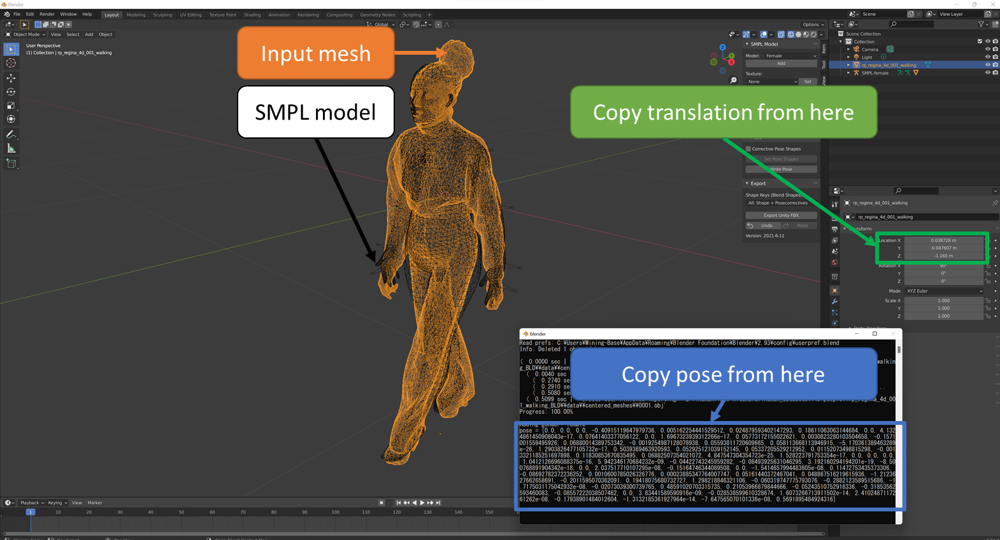

# Tutorial to Fit SMPL model to a sequence aof 3D meshes

# REQUIREMENTS
Blender & SMPL blender add on => download at https://smpl.is.tue.mpg.de/download.php  
Visual Studio (or XCODE for mac)  

# Build the C++ MatchSMPL code
```
mkdir build  
cd build  
cmake .. -D_CUDA_=TRUE -G"Visual Studio 16 2019"  (for Windows)
cmake .. -D_APPLE_=TRUE -G"Xcode"  (for Mac)
make                               (for Mac)
```

# 1. Initialize the SMPL pose from Blender  
  

1. Open Blender & Install SMPL add-on on BLender    
2. Import the first mesh in ```data_name/data/resampled_meshes``` in blender    
3. Add a SMPL model and switch to pose model  
4. Manually fit the pose of SMPL model to match pose of the 3D mesh, then click "Write pose".    
    - Do not translate the smpl model, only the input mesh.  
    - Click on each joint to rotate it. Do not translate the joint.  
5. Open Blender cosole (```Window/Toggle system console```)
6. Press the Write Pose button on the SMPL addon to output Pose information to the console, copy it, and paste it into ```pose_[first_frameID]_init.txt``` in ```data_name/data/smplparams``` dir (See figure , not include ("[" , "]")).   
    - Also, copy mesh's location parameters to ```trans_[first_frameID]_init.txt``` in ```data_name/data/smplparams``` dir (See figure , Separate with a space) .  
    - The [first_frameID] is a four-digit number such as 0001.
7. Run follow command to change files format

```
python utils/pose_init_2_bin.py --pose_path /path/to/pose_[first_frameID]_init.txt --trans_path  /path/to/trans_[first_frameID]_init.txt 
```

<!-- 
# 2. Run "Refine_FitSMPL_Scan.py" script first
For initialization , Run following command  
```
python Refine_FitSMPL_Scan.py --path /path/to/<data_set> --init_flg True --start_id 1 --resampled_flg True
```

&nbsp;&nbsp;&nbsp;After this command , Check if "pose_[first_frameID].bininput.ply" and "pose_[first_frameID].binfitted.obj" are in the same position.  
   

# 3. Run "Refine_FitSMPL_Scan.py" script for all meshes.
For following mesh, Run following command  
```
python Refine_FitSMPL_Scan.py --path /path/to/<data_set> --size <data_size> --init_flg False --start_id 1 --resampled_flg True
```
-->